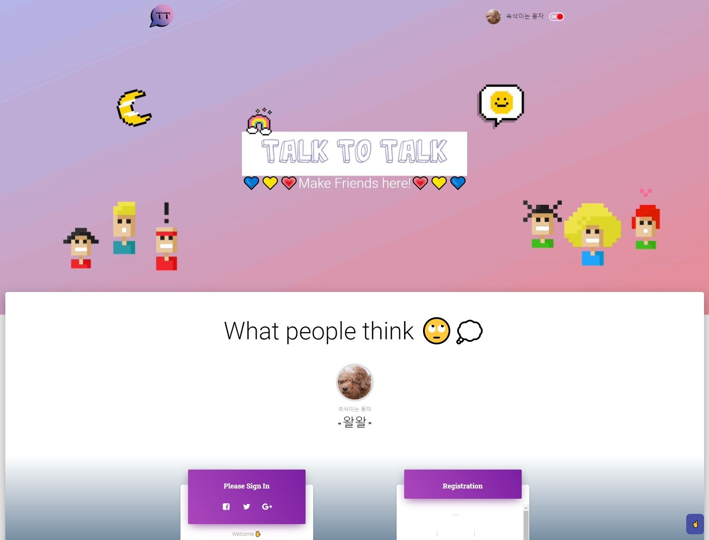
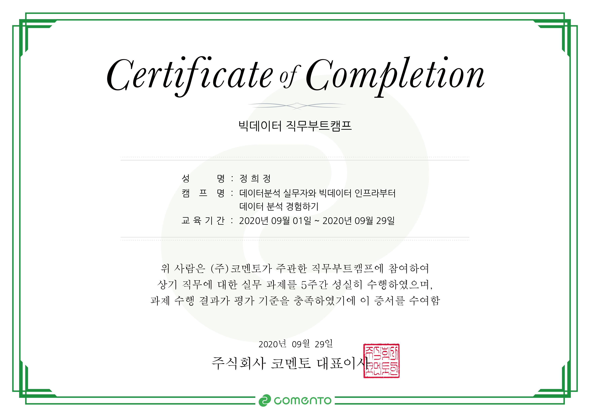
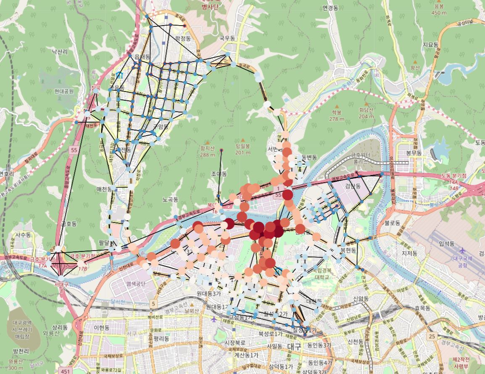
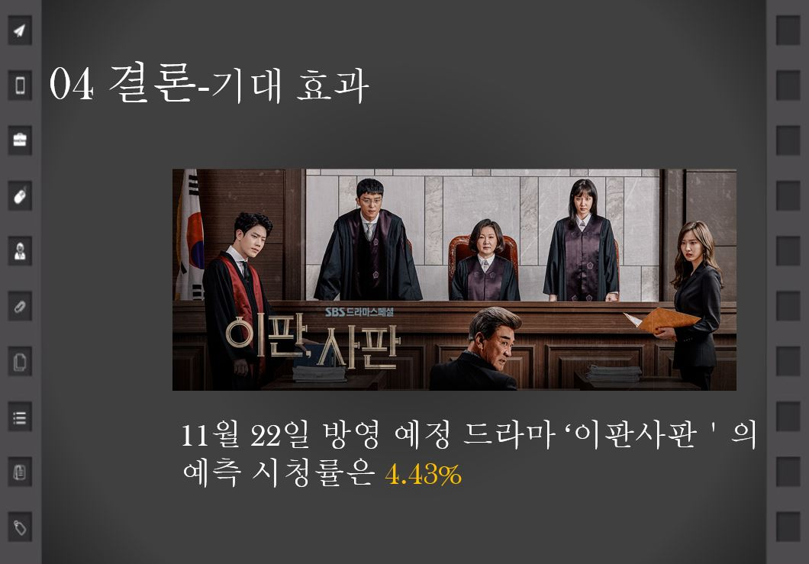
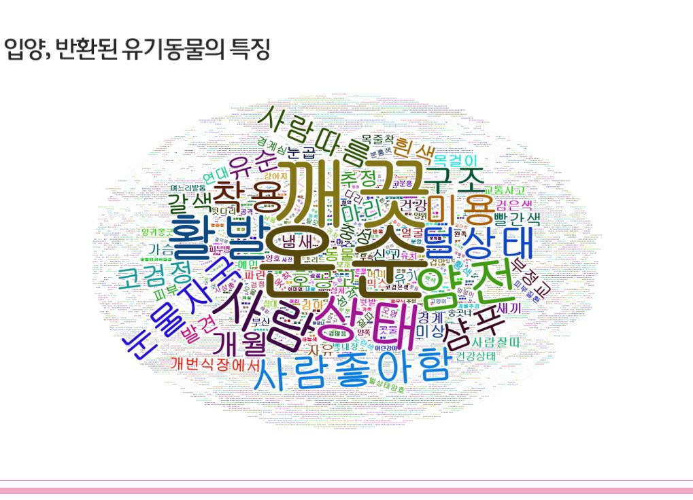
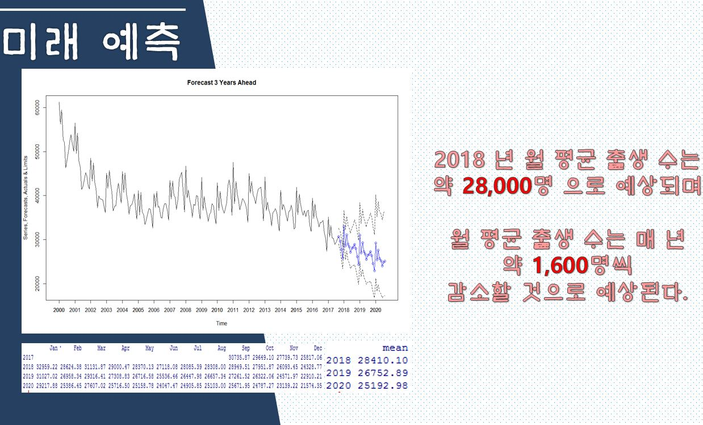

<!DOCTYPE html>
<html lang="en">
  <head>
    <meta charset="utf-8" />
    <meta name="viewport" content="width=device-width, initial-scale=1, shrink-to-fit=no" />
    <meta name="description" content="" />
    <meta name="author" content="" />
    <link href="https://fonts.googleapis.com/css?family=Lato:100,300,400,700,900" rel="stylesheet" />
    <title>HuijeongJeong</title>
	<!-- Reflux Template https://templatemo.com/tm-531-reflux -->
    <!-- Bootstrap core CSS -->
    <link href="vendor/bootstrap/css/bootstrap.min.css" rel="stylesheet" />
	<link rel="shortcut icon" href="assets/images/icon.ico">

    <!-- Additional CSS Files -->
    <link rel="stylesheet" href="assets/css/fontawesome.css" />
    <link rel="stylesheet" href="assets/css/templatemo-style.css" />
    <link rel="stylesheet" href="assets/css/owl.css" />
    <link rel="stylesheet" href="assets/css/lightbox.css" />
    
  </head>

  <body>
    

      <!-- Sidebar Menu -->
      

        <i class="fa fa-bars" id="menu-toggle"></i>
        

          <i class="fa fa-times" id="menu-close"></i>
          

            

              
            

            

              <h4>정희정</h4>
              😄Huijeong Jeong😄
            

            <nav class="main-nav" role="navigation">
              <ul class="main-menu">
                <li><a href="#section1">자기 소개</a></li>
                <li><a href="#section2">언어</a></li>
                <li><a href="#section2-1">개발 기술</a></li>
                <li><a href="#section2-2">개발 도구</a></li>
                <li><a href="#section3">포트폴리오</a></li>
                <li><a href="#section4">메일</a></li>
              </ul>
            </nav>
            

              <ul class="soial-icons">
                <li>
                  <a href="https://github.com/heejungjung"><i class="fa fa-github"></i></a>
                </li>
                <li>
                  <a href="https://www.instagram.com/j.amy_jeong/"><i class="fa fa-instagram"></i></a>
                </li>
                <li>
                  <a href="https://www.linkedin.com/in/huijeong-jeong-519a0017b/"><i class="fa fa-linkedin"></i></a>
                </li>
              </ul>
            

            

              
Copyright 2019 Reflux Design

              
Icon:Pixel perfect from www.flaticon.com

            

          

        

      

      <section class="section about-me" data-section="section1">
        

          

            <h1>자기 소개</h1>
            

 
            <h4>안녕하세요, 저는 정희정입니다.😀</h4> 
		    
👉 저는 풀스택 개발자를 목표로 하고 있습니다.

			
👉 데이터 분석,백엔드,웹 개발 등 코딩으로 무엇인가를 만들고 결과를 도출해내는 것을 즐깁니다.

			
👉 배움을 멈추지 않고 계속 도전해나가는 삶을 살고 싶습니다.

          

          
          

          

		      

		        

		          

		            <h3 class=" text-light">👩‍🎓 경북대학교 통계학 전공</h3>
		            
👉 빅데이터 연계전공

		          

		          

		            <h6>2015</h6>
		          

		          

		            <time>2015-02 ~ 2019-08</time>
		          

		        

		        

		          

		            <h3 class=" text-light">👩‍🏫 입시 학원 강사</h3>
		            
👉 고등 입시수학 강사

		          

		          

		            <h6>&nbsp;&nbsp;&nbsp;&nbsp;</h6>
		          

		          

		            <time>2015-02 ~ 2016-11</time>
		          

		        

		        

		          

		            <h3 class=" text-light">👩‍💼 뉴욕뉴욕 웨딩</h3>
		            
👉 조명 및 음향 관리

		          

		          

		            <h6>2017</h6>
		          

		          

		            <time>2017-01 ~ 2017-12</time>
		          

		        

		        

		          

		            <h3 class=" text-light">🥇 통계 분석 대회 수상</h3>
		            
👉 최우수상

		          

		          

		            <h6>&nbsp;&nbsp;&nbsp;&nbsp;</h6>
		          

		          

		            <time>2017-11-22</time>
		          

		        

		        

		          

		            <h3 class=" text-light">👩‍💼 Geo C&I 계약직</h3>
		            
👉 산림 데이터 정리

		          

		          

		            <h6>2018</h6>
		          

		          

		            <time>2017-01 ~ 2017-12</time>
		          

		        

		        

		          

		            <h3 class=" text-light">👭 외국인 버디</h3>
		            
👉 교내 외국인 입학생들이 적응할 수 있도록 도와주는 활동

		          

		          

		            <h6>&nbsp;&nbsp;&nbsp;&nbsp;</h6>
		          

		          

		            <time>2018-03 ~ 2018-06</time>
		          

		        

		        

		          

		            <h3 class=" text-light">🏫 통계청 재능 기부</h3>
		            
👉 중-고등학생들에게 통계 및 빅데이터 특별 수업 진행

		          

		          

		            <h6>&nbsp;&nbsp;&nbsp;&nbsp;</h6>
		          

		          

		            <time>2018-03 ~ 2018-11</time>
		          

		        

		        

		          

		            <h3 class=" text-light">📃 사회조사분석사 2급</h3>
		            
👉 최종합격

		          

		          

		            <h6>&nbsp;&nbsp;&nbsp;&nbsp;</h6>
		          

		          

		            <time>2018-08</time>
		          

		        

		        

		          

		            <h3 class=" text-light">📃 SAS Advanced</h3>
		            
👉 최종합격

		          

		          

		            <h6>&nbsp;&nbsp;&nbsp;&nbsp;</h6>
		          

		          

		            <time>2018-08</time>
		          

		        

		        

		          

		            <h3 class=" text-light">📃 TOEIC Speaking</h3>
		            
👉 140

		          

		          

		            <h6>2019</h6>
		          

		          

		            <time>2019-06-16</time>
		          

		        

		        

		          

		            <h3 class=" text-light">👩‍💼 한국감정원</h3>
		            
👉 부동산 데이터 전산입력 및 서류 검토

		          

		          

		            <h6>&nbsp;&nbsp;&nbsp;&nbsp;</h6>
		          

		          

		            <time>2018-11 ~ 2018-12</time>
		          

		        

		        

		          

		            <h3 class=" text-light">👩‍💼 한국감정원</h3>
		            
👉 부동산 데이터 전산입력 및 서류 검토

		          

		          

		            <h6>&nbsp;&nbsp;&nbsp;&nbsp;</h6>
		          

		          

		            <time>2019-08 ~ 2019-09</time>
		          

		        

		        

		          

		            <h3 class=" text-light">👩‍💼 Grand SK</h3>
		            
👉 supply 소싱 및 인보이싱

		          

		          

		            <h6>&nbsp;&nbsp;&nbsp;&nbsp;</h6>
		          

		          

		            <time>2019-10 ~ 2020-04</time>
		          

		        

		        

		          

		            <h3 class=" text-light">📃 TOEIC</h3>
		            
👉 870

		          

		          

		            <h6>2020</h6>
		          

		          

		            <time>2020-09-13</time>
		          

		        

		      

			

          

        

      </section>

      <section class="section my-services" data-section="section2">
        

          

            <h2>언어</h2>
            

          

          

            

              

                

                <h4>R</h4>
              

            

            

              

                

                <h4>Java</h4>
              

            

            

              

                

                <h4>MySQL</h4>
              

            

            

              

                

                <h4>SAS</h4>
              

            

            

              

                

                <h4>Python</h4>
              

            

            

              

                

                <h4>Javascript</h4>
              

            

            

              

                

                <h4>HTML5</h4>
              

            

            

              

                

                <h4>CSS3</h4>
              

            

          

        

      </section>

      <section class="section my-services" data-section="section2-1">
        

          

            <h2>개발 기술</h2>
            

          

          

            

              

                

              

            

            

              

                

              

            

            

              

                

              

            

            

              

                

              

            

            

              

                

              

            

            

              

                

              

            

            

              

                

              

            

            

              

                

              

            

          

        

      </section>

      <section class="section my-services" data-section="section2-2">
        

          

            <h2>개발 도구</h2>
            

          

          

            

              

                

              

            

            

              

                

              

            

            

              

                

              

            

            

              

                

              

            

            

              

                

              

            

          

        

      </section>

      <section class="section my-work" data-section="section3">
        

          

            <h2>포트폴리오</h2>
            

          

          

            

              <form class="isotope-toolbar">
                <label>
                	<input type="radio" data-type="*" checked="" name="isotope-filter"/>
                  전체보기</label>
                <label>
                	<input type="radio" data-type="analysis" name="isotope-filter"/>
                  데이터 분석</label>
                <label>
                	<input type="radio" data-type="project" name="isotope-filter"/>
                  프로젝트</label>
                <label>
                	<input type="radio" data-type="contest" name="isotope-filter"/>
                  공모전</label>
              </form>
              

                

                  <figure class="snip1321">
                    
                    <figcaption>
                      <a href="assets/images/ttt.JPG" data-lightbox="Talk To Talk" data-title="Caption">
                      <i class="fa fa-search"></i></a>
                      <h4>Talk To Talk</h4>
                      직업 훈련 과정에서 작업한 Talk To Talk이라는 채팅 웹사이트 입니다.
	                  MySQL과 연결하여 DB에 회원정보 및 채팅방 정보,채팅 메시지를 저장하여 후에 데이터 분석에 이용할 수 있도록 설정하였습니다.
	                  (후에 페이스톡 및 다양한 채팅 통계 자료를 추가하여 기능을 완성시킬 예정입니다.)
	                  

	                    <a href="https://github.com/heejungjung/TalkToTalk">Visit</a>
	                  

                    </figcaption>
                  </figure>
                

                

                  <figure class="snip1321">
                    
                    <figcaption>
                      <a href="assets/images/comento.jpg" data-lightbox="Comento" data-title="Caption">
                      <i class="fa fa-search"></i></a>
                      <h4>Comento</h4>
                      데이터 분석가로서의 실무를 경험하고자 온라인 직무 체험 캠프에 참가하였습니다.
	                  총 한달 간의 직무 체험 캠프를 통해서 복잡한 실무 데이터에 대한 대처 방법과 적절한 문서화 방법을 배울 수 있었습니다.
	                  또한 현직 멘토님으로부터 좋은 데이터 분석가가 되기 위한 조언을 얻어 앞으로의 방향성을 수립하는 데 좋은 경험이 되었습니다.
                    </figcaption>
                  </figure>
                

                

                  <figure class="snip1321">
                    
                    <figcaption>
                      <a href="assets/images/MathematicalBigdata.JPG" data-lightbox="효율적 선거운동 지역 모색" data-title="Caption">
                      <i class="fa fa-search"></i></a>
                      <h4>효율적 선거운동 지역 모색</h4>
                      QGis, Gephi, Python을 이용한 network를 통해 선거운동을 위한 가장 효율적인 장소 분석 : 
                      	사이트(http://nodelink.its.go.kr/)에서 다운로드 받은 node와 link 파일을 이용,
						A 지역의 중요성을 보기 위해서는 A 지역을 제외한 지역을 지나는 사람들이 다른 지역으로 이동할 때 얼마나 A를 거쳐 가는 지를 살펴보는 아이디어를 바탕으로
						노드들 간의 최단 경로를 계산하는 Betweenness Centrality를 구하였다.
                    </figcaption>
                  </figure>
                

                

                  <figure class="snip1321">
                    
                    <figcaption>
                      <a href="assets/images/drama.JPG" data-lightbox="통계 분석 공모전" data-title="Caption">
                      <i class="fa fa-search"></i></a>
                      <h4>StatAnalysisContest</h4>
                      교내 통계 분석 공모전에서 '드라마 시청률 예측'을 주제로 최우수상을 수상하였습니다.
                      사이트 DAUM에서 드라마 정보를 크롤링하여 데이터 세트를 만들어 분석하였습니다.
                    </figcaption>
                  </figure>
                

                

                  <figure class="snip1321">
                    
                    <figcaption>
                      <a href="assets/images/datamining.JPG" data-lightbox="유기동물 입양 예측" data-title="Caption">
                      <i class="fa fa-search"></i></a>
                      <h4>유기동물 입양 예측</h4>
                      공공데이터 포털의 유기동물 데이터를 이용하여 유기동물의 품종,외향상태,질병여부 등 여러 요소가 입양여부에 어떤 영향을 미치는지 분석한 프로젝트입니다.
                    </figcaption>
                  </figure>
                

                

                  <figure class="snip1321">
                    
                    <figcaption>
                      <a href="assets/images/timeseries.JPG" data-lightbox="출생률 예측" data-title="Caption">
                      <i class="fa fa-search"></i></a>
                      <h4>출생률 예측</h4>
                      시계열 분석을 통하여 대한민국의 월별 출생률을 예측하는 프로젝트입니다.
                    </figcaption>
                  </figure>
                

              

            

          

        

      </section>

      <section class="section contact-me" data-section="section4">
        

          

            <h2>메일</h2>
            

          

          

            

              

                <form id="contact" action="mailto:junghee528@naver.com" method="post" enctype="multipart/form-data" name="EmailForm">
                  

                    

                      <fieldset>
                        <input name="name" type="text" class="form-control" id="name" placeholder="Your name..." required=""/>
                      </fieldset>
                    

                    

                      <fieldset>
                        <input name="email" type="text" class="form-control" id="email" placeholder="Your email..." required=""/>
                      </fieldset>
                    

                    

                      <fieldset>
                        <input name="subject" type="text" class="form-control" id="subject" placeholder="Subject..." required=""/>
                      </fieldset>
                    

                    

                      <fieldset>
                        <textarea name="message" rows="6" class="form-control" id="message" placeholder="Your message..." required=""></textarea>
                      </fieldset>
                    

                    

                      <fieldset>
                        <button type="submit" id="form-submit" class="button">메일 보내기</button>
                      </fieldset>
                    

                  

                </form>
              

            

          

        

      </section>
    

    <!-- Scripts -->
    <!-- Bootstrap core JavaScript -->
    
    

    
    
    
    
    
  </body>
</html>
